## Laporan Praktikum Sistem Operasi Jobsheet 

<h4>Nama : Rafif Rizdan Prastana<h4>
<h4>NIM  : 254107020052<h4>
<h4>Kelas : TI 1H<h4>

### Prakti : Instalasi Ubuntu Server 22.04 LTS

#### 1. Create Virtual Machine

#### 2. Configure VM Settings

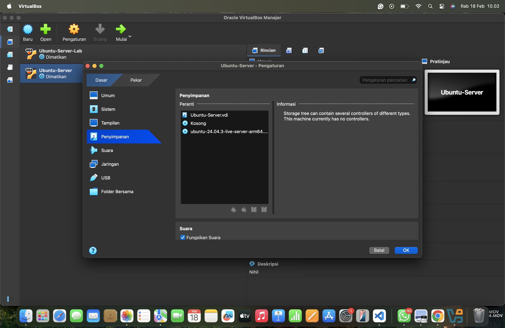

#### 3. Boot and Install

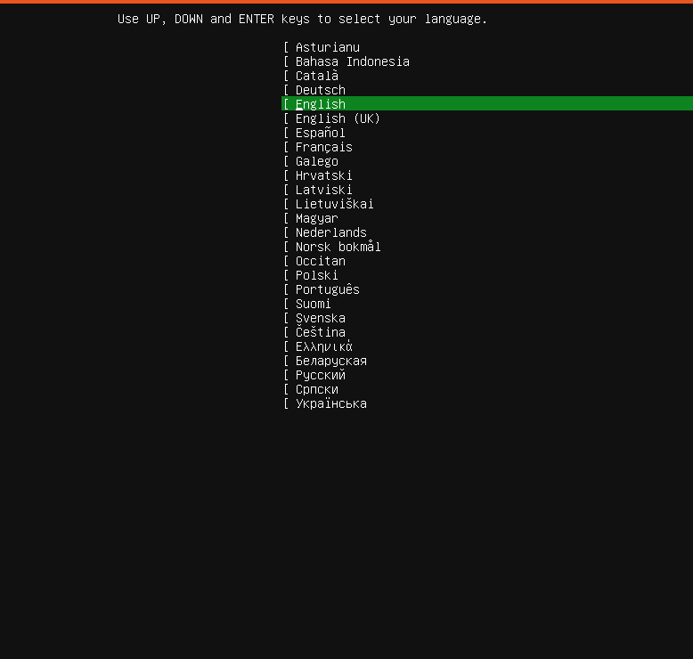

#### 8. Installation Progress

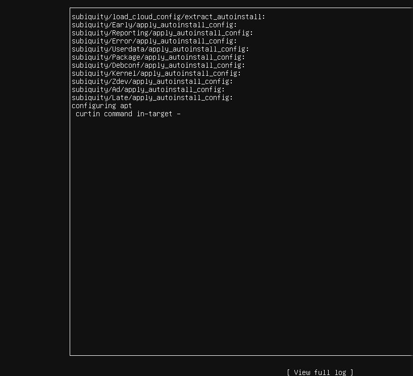

#### 9. First Login

a. Login dengan username yang dibuat

## 1.7.6. Praktik: Manual Partitioning

#### 1. Check disk usage
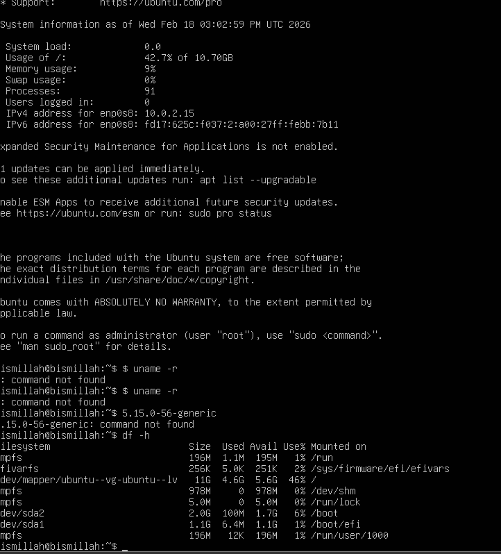

#### 2. Check disk partitions
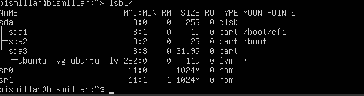

#### 3. Check filesystem type

## 1.8.1. System Updates

#### 1. Update package lists from repositories

#### 2. Upgrade installed packages to latest versions
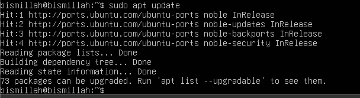

#### 3. Full system upgrade ( handles dependencies )
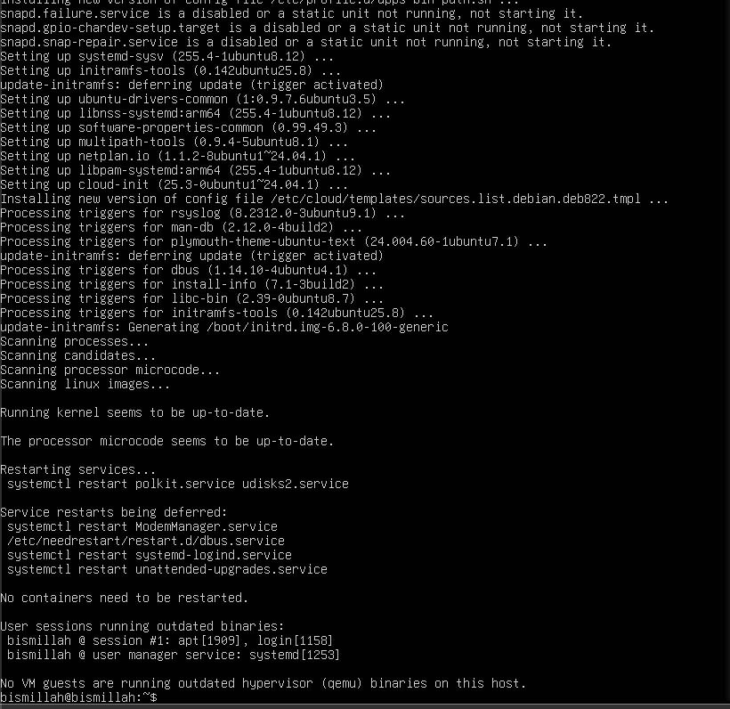

#### 4. Remove packages yang tidak dibutuhkan
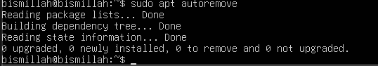

#### 5. Clean package cache
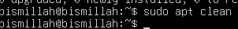

## 1.8.2. Software Installation Essentials

#### 1. Development tools

#### 2. Version control
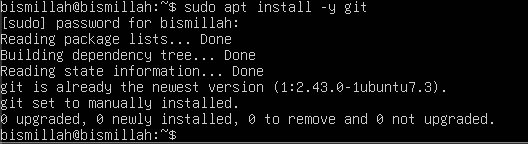

#### 3. Network utilities

## 1.8.3. Verifikasi Koneksi Jaringan

#### 1. Check IP address

#### 2. Test internet connectivity
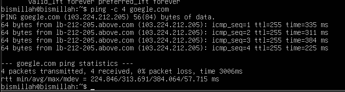

#### 3. Check DNS
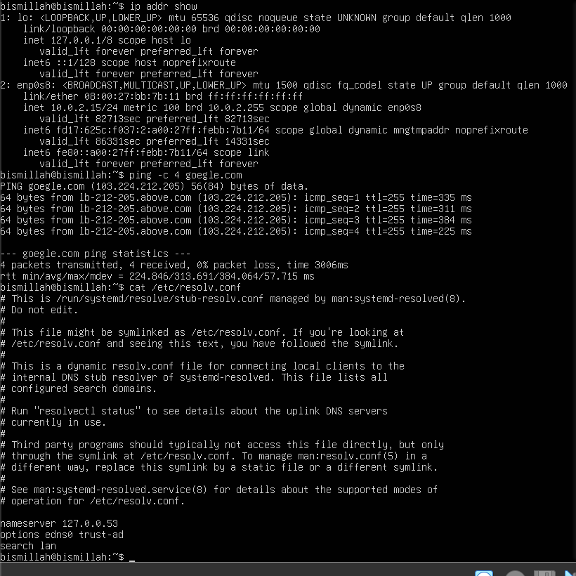

## 1.8.5. Menampilkan Informasi Sistem

#### 1. Install neofetch
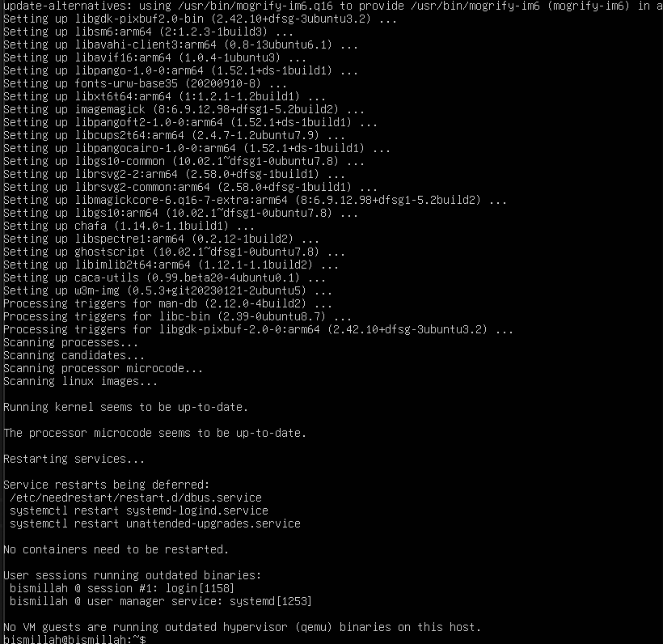

#### 2. Run neofetch

## 1.10. Latihan

### 1.10.1. Latihan Konseptual

#### Latihan 1.1

#### Jelaskan 5 fungsi utama sistem operasi dengan contoh konkret dari minimal 2 OS berbeda (Windows, macOS, atau Linux).

Jawab : 

1. Manajemen Proses (CPU)

OS mengatur jadwal tugas yang dikerjakan oleh prosesor. Ia memastikan setiap aplikasi mendapatkan giliran tanpa membuat komputer hang.

Contoh: Windows menggunakan Task Manager untuk memantau proses, sementara Linux menggunakan perintah top di terminal.

2. Manajemen Memori (RAM)

OS mengalokasikan ruang di RAM untuk aplikasi yang sedang berjalan dan mengambilnya kembali saat aplikasi ditutup agar tidak boros.

Contoh: macOS punya fitur Memory Compression untuk memadatkan data di RAM, sedangkan Windows menggunakan Virtual Memory saat RAM fisik penuh.

3. Manajemen File

OS mengatur cara data disimpan, dinamai, dan dikelompokkan dalam folder agar mudah dicari dan aman.

Contoh: Windows menggunakan sistem file NTFS, sementara macOS menggunakan APFS yang dioptimalkan untuk SSD.

4. Manajemen Perangkat (I/O)

OS mengelola komunikasi dengan perangkat keras luar seperti printer, mouse, dan monitor melalui perantara yang disebut driver.

Contoh: Di Linux, hampir semua driver sudah menyatu di inti (kernel), sedangkan di Windows, OS sering mengunduh driver otomatis lewat Windows Update.

5. Penyedia Antarmuka (User Interface)

OS menyediakan tampilan agar pengguna bisa memberikan perintah, baik lewat klik ikon (GUI) atau baris perintah teks (CLI).

Contoh: macOS identik dengan tampilan Aqua yang elegan, sementara Linux memungkinkan pengguna mengganti tampilan sepenuhnya (seperti GNOME atau KDE).

### Latihan 1.2

#### Kapan sebaiknya menggunakan Windows vs Linux vs macOS? Analisis berdasarkan use case: gaming, development, server, creative work, dan enter- prise.

Jawab : 

1. Gaming: Windows

Karena dukungan driver kartu grafis terbaik dan hampir semua judul game steam dirancang khusus untuk Windows.

2. Development: Linux / macOS

Keduanya berbasis Unix, sangat stabil untuk coding, menjalankan Docker, dan mengelola server lokal dengan terminal yang sangat bertenaga.

3. Server: Linux

Standar industri dunia karena gratis, sangat ringan, dan memiliki tingkat keamanan paling tinggi.

4. Creative Work: macOS

Pilihan utama desainer dan video editor karena optimasi perangkat lunak yang sangat mulus serta akurasi warna layar yang konsisten.

5. Enterprise: Windows

Standar dunia perkantoran berkat integrasi penuh dengan Microsoft 365 dan sistem manajemen jaringan kantor yang sangat matang.

### 1.10.2. Latihan Praktikal

#### Latihan 1.3

#### Install Ubuntu Server 22.04 LTS di VirtualBox dengan langkah berikut: 
1. Download Ubuntu Server ISO dari website resmi 
2. Create VM baru di VirtualBox (RAM: 2GB, Disk: 25GB)
3. Install dengan automatic partitioning (guided)
4. Buat user account dengan password yang kuat
5. Reboot dan login ke sistem
6. Dokumentasikan proses instalasi dengan screenshot key steps

Jawab : Done, Diatas

#### Latihan 1.4

#### Setelah instalasi Ubuntu Server, lakukan tasks berikut:
1. Update package list: sudo apt update
2. Upgrade packages: sudo apt upgrade
3. Install neofetch: sudo apt install neofetch
4. Jalankan neofetch dan screenshot hasilnya
5. Check disk usage dengan df -h
6. Check memory dengan free -h
7. Dokumentasikan output dari setiap command 

Jawab : Done, sudan diatas

#### Latihan 1.5

#### Eksplorasi sistem yang baru diinstall:
1. Tampilkan informasi OS: cat /etc/os-release
2. Tampilkan versi kernel: uname -r
3. List partisi: lsblk
4. Check network connectivity: ping -c 4 google.com
5. Install dan jalankan htop untuk melihat resource usage
6. Buat laporan singkat tentang konfigurasi sistem Anda

Jawab : Done, Sudah diatas

### 1.10.3. Latihan Refleksi

#### Latihan 1.6

#### Ceritakan pengalaman Anda dengan sistem operasi:
1. Sistem operasi apa yang Anda gunakan sehari-hari? (Windows, macOS,
Linux, atau lainnya)
2. Berapa lama Anda menggunakan sistem operasi tersebut?
3. Apa yang Anda sukai dari sistem operasi tersebut?
4. Apa tantangan atau masalah yang pernah Anda hadapi?
5. Apakah Anda pernah menggunakan sistem operasi lain? Bandingkan
pengalaman Anda.
6. Setelah mempelajari bab ini, apakah ada sistem operasi lain yang ingin
Anda coba? Mengapa?

Jawab : 
1. Sebelumnya saat di SMA saya menggunakan Windows, Dan saat kuliah saya pindah menggunakan macOS.
2. Lumayan lama sekitar 3 jam an, karena jaringan yang kurang bagus.
3. Bisa memperlajari hal haru yang sebelumnya saya belum tau.
4. Sejauh ini belum, karena hanya mengikuti perintang dari dokumen saja.
5. Masih belum sama sekali.
6. Belum, karena saya masih penasaran sama sistem operasi ini.

 

