## Laporan Praktikum Sistem Operasi Jobsheet

<h4>Nama : Rafif Rizdan Prastana<h4>
<h4>NIM  : 254107020052<h4>
<h4>Kelas : TI 1H<h4>

### Praktikum 2.1 — Identifikasi CPU dan Memori

#### 1. Tampilkan informasi CPU:

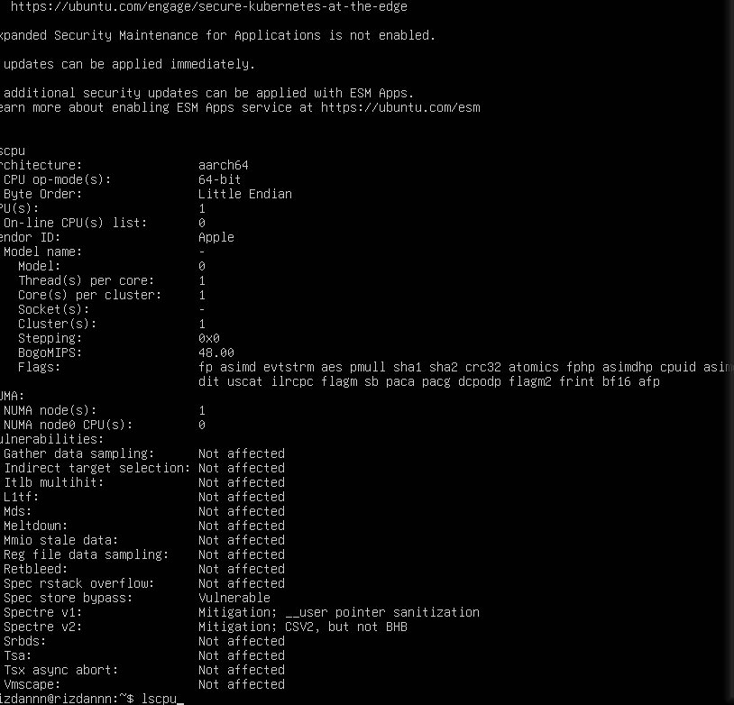

#### 2. Tampilkan ringkasan memori:

#### 3. (Opsional) cek informasi hardware dari DMI/BIOS (butuh sudo):

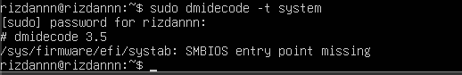

### Latihan 2.1
#### Catat : (1) jumlah CPU(s), core/thread, (2) total RAM, (3) total swap. Jelaskan perbedaan RAM vs swap dalam 2–3 kalimat.
Jawab : RAM adalah perangkat keras fisik tempat komputer menyimpan data yang sedang aktif digunakan untuk akses super cepat, sedangkan swap adalah area di penyimpanan (SSD/HDD) yang digunakan sebagai cadangan ketika RAM sudah penuh.

### Praktikum 2.2 — Identifikasi Perangkat PCI/USB dan Driver

#### 1. Lihat daftar perangkat PCI:
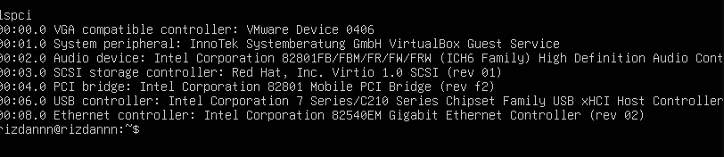

#### 2. Lihat perangkat PCI beserta driver kernel yang digunakan:
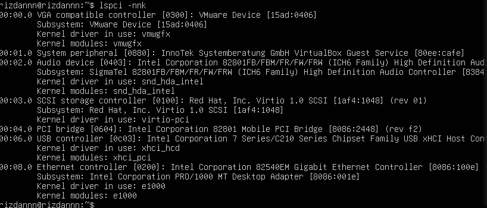

#### 3. Fokus pada NIC (Ethernet) untuk mencari modul driver:
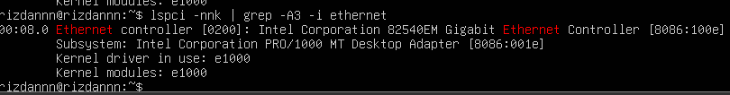

#### 4. Lihat perangkat USB:

#### 5. Lihat topologi USB (tree):
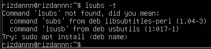

## Latihan 2.2

#### Temukan 1 perangkat PCI (misal NIC) dan tuliskan: Vendor:Device ID (angka heksadesimal), nama driver/modul kernel, dan deskripsi singkat fungsinya.

Jawab :

Berdasarkan hasil perintah lspci -nnk, berikut adalah detail untuk satu perangkat PCI (Network Interface Card/NIC):

Vendor:Device ID: 8086:100e

Kernel Driver/Modul: e1000

Deskripsi Fungsi: Perangkat ini adalah Intel Corporation 82540EM Gigabit Ethernet Controller. Fungsinya adalah sebagai kartu jaringan (NIC) yang memungkinkan komputer terhubung ke jaringan kabel (Ethernet) dengan kecepatan hingga 1 Gbps. Modul e1000 berfungsi sebagai penggerak (driver) agar sistem operasi Linux dapat berkomunikasi dengan perangkat keras tersebut untuk mengirim dan menerima data melalui jaringan.

## Praktikum 2.3 — Identifikasi Storage dan Filesystem

#### 1. Lihat daftar disk/partisi:
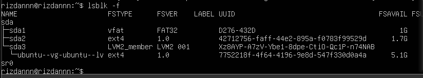

#### 2. Tampilkan UUID dan tipe filesystem:
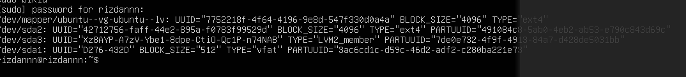

#### 3. Lihat mount point untuk root filesystem:
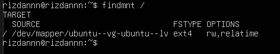

## Praktikum 2.4 — Melihat Modul Aktif dan Informasinya

#### 1. Cek versi kernel:
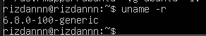

#### 2. Tampilkan daftar modul aktif:
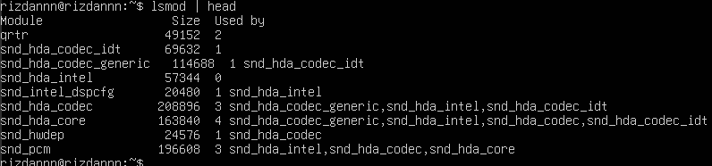

#### 3. Pilih salah satu modul (contoh aman: loop) dan lihat detailnya:
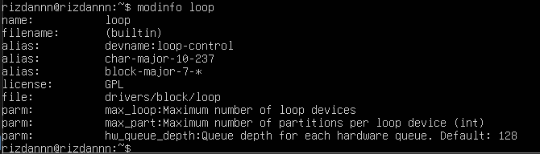

#### 4. Muat modul (jika belum aktif), lalu verifikasi:
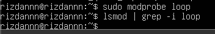

#### 5. (Opsional) lihat pesan kernel terbaru:
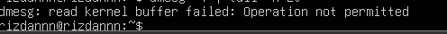

## Praktikum 2.5 — Konfigurasi Auto-load dan Blacklist

#### 1. Buat file auto-load:
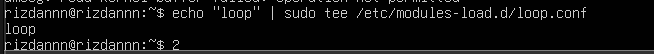

#### 2. Simulasikan verifikasi (tanpa reboot) dengan memastikan modul sudah aktif:

## Praktikum 2.6 — Mengenali Block vs Character Device

#### 1 Manajemen Perangkat Keras & Perintah Dasar Sistem Operasi

#### 2. Lihat detail device terminal:

#### 3. Lihat disk dan partisi untuk mengaitkan dengan /dev:
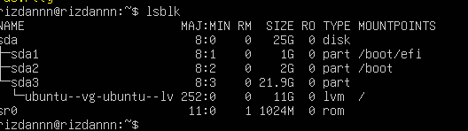

## Latihan 2.3

#### Dari output ls -l, jelaskan perbedaan penanda file untuk block device dan character device. (Hint: karakter pertama pada permission string)

Jawaban :  block device memungkinkan akses random sedangkan character device biasanya tidak mendukung akses random

## Praktikum 2.7 — Melihat Informasi udev

#### 1. Cek atribut udev untuk disk:
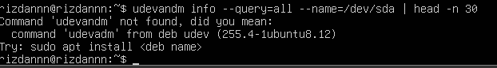

#### 2. (Opsional) monitor event udev (jalankan, lalu colok/lepas USB pada mesin fisik):
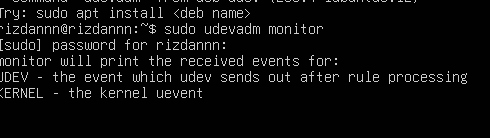

## Praktikum 2.8 — Membuat Workspace Praktikum

#### 1. Buat direktori praktikum dan masuk ke dalamnya:
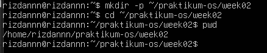

#### 2. Buat beberapa file contoh:
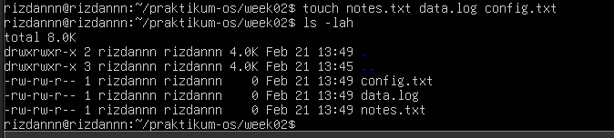

#### 3. Isi file log contoh (simulasi):
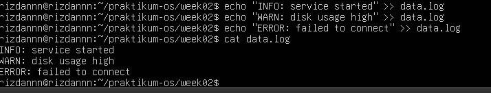

#### 4. Baca file dengan less:
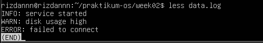

## Praktikum 2.10 — Substitusi dengan sed (Aman di File Latihan)

#### 1. Siapkan file konfigurasi latihan:

#### 2. Ganti dev menjadi prod (tanpa mengubah file asli):
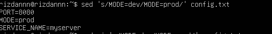

#### 3. Terapkan perubahan langsung ke file (-i):
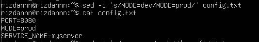

#### 4. Ganti semua kemunculan kata (guntuk global), contoh ubah myservermenjadi node:
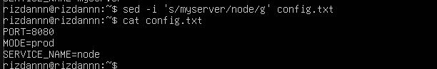

## Praktikum 2.11 — Ekstraksi Kolom dengan awk

#### 1. Lihat output df -h:
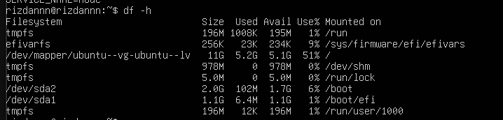

#### 2. Ambil kolom filesystem dan persentase pemakaian:
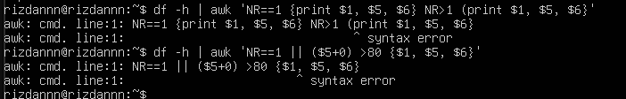

## Praktikum 2.12 — Melihat Proses dengan ps

#### 1. Tampilkan semua proses (format BSD):
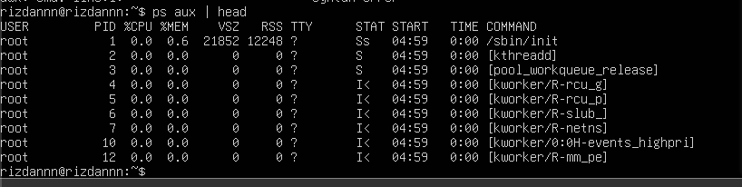

#### 2. Cari proses tertentu (misal sshd):
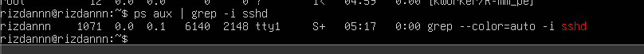

## Praktikum 2.13 — Monitoring Real-time dengan top

#### 1. Jalankan top:
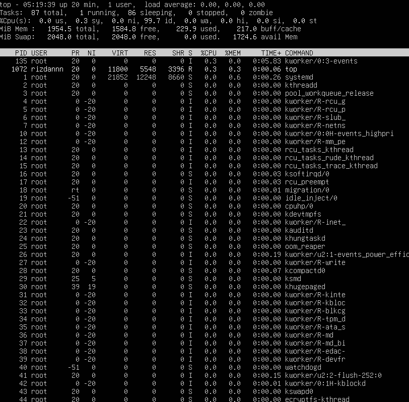

## Praktikum 2.14 — Menghentikan Proses dengan kill

#### 1. Jalankan proses dummy di background:
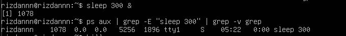

#### 2. Hentikan dengan SIGTERM:

#### 3. Verifikasi proses berhenti:
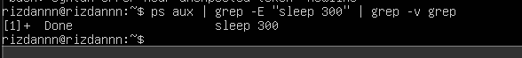

## Praktikum 2.15 — Cek Disk, Load, dan Service

#### 1. Cek penggunaan disk:
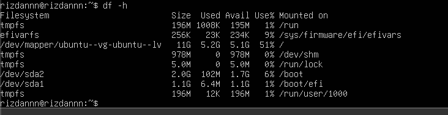

#### 2. Cari direktori yang besar (contoh pada /var):
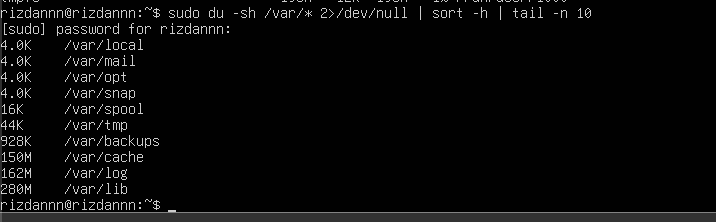

#### 3. Cek load dan uptime:

#### 4. Cek service yang gagal:
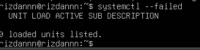

## Praktikum 2.16 — Monitoring Port dan Koneksi (Network Basics)

#### 1. Lihat interface dan IP:
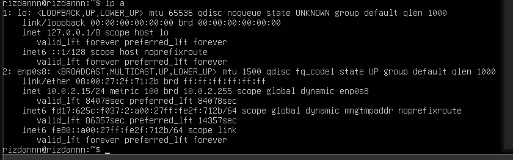

#### 2. Lihat routing table:
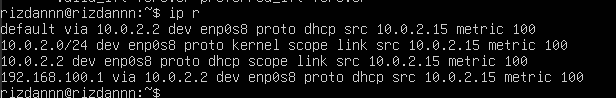

#### 3. Lihat port yang sedang listening:
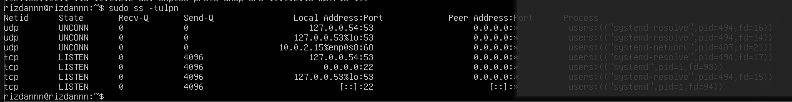

## Latihan 2.5

#### Pilih satu port yang listening dari output ss -tulpn(misal port 22), lalu tuliskan service/proses yang membukanya. Jelaskan kegunaan port tersebut secara singkat.

Jawaban : port 22 digunakan untuk layanan SSH (Secure Shell). Kegunaan utamanya untuk keamanan

## 1.9 Latihan

### Latihan 2.A

#### Jalankan lspci -nnk. Pilih 1 perangkat PCI dan tuliskan: nama perangkat, ID vendor:device, dan kernel driver in use.
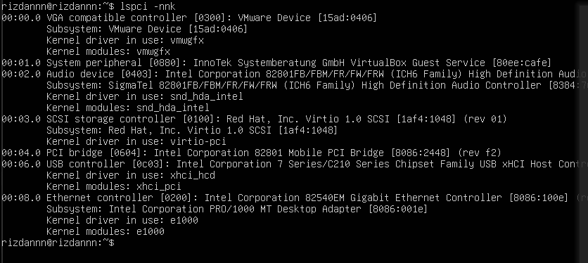

Jawaban : Nama perangkat (Ethernet controller [0200]: Intel Corporation 82540EM Gigabit Ethernet Controller), 
ID vendor ([8086:100e]), kernel driver is use (e1000)

### Latihan 2.B
#### Tentukan device root filesystem dengan findmnt /. Lalu cocokkan dengan lsblk -f dan tuliskan tipe filesystem serta UUID-nya.
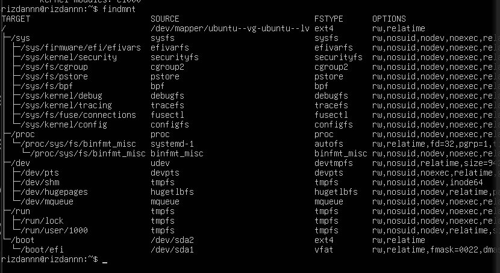
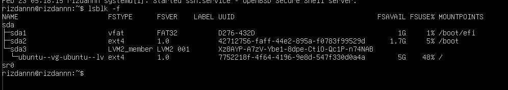

Jawaban : Device root filysytem berada di sda3 dengan nama ubuntu--vg-ubuntu--lv. Tipe filesystemnya adalah ext4 dan UUIDnya adalah 7752218f-4f64-4196-9e8d-547f330d0a4a

### Latihan 2.C
#### Buat file server.log berisi minimal 10 baris dengan variasi kata: INFO, WARN, ERROR. Gunakan grep untuk menampilkan hanya baris ERROR.
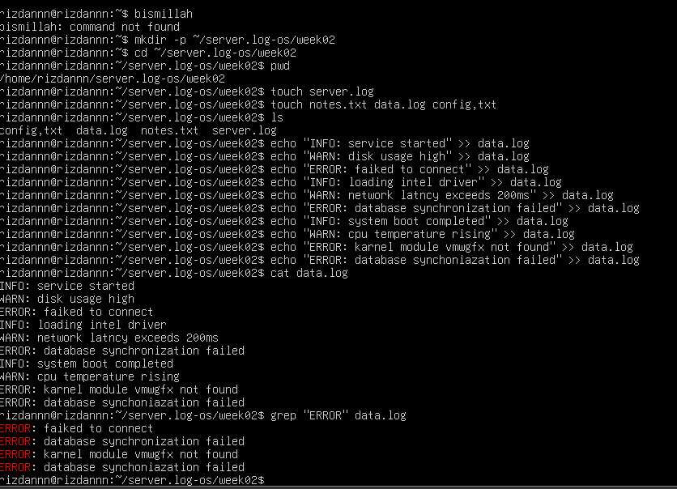

### Latihan 2.D
#### Gunakan sed untuk mengganti semua kata server menjadi node pada file latihan. Tunjukkan sebelum dan sesudah.
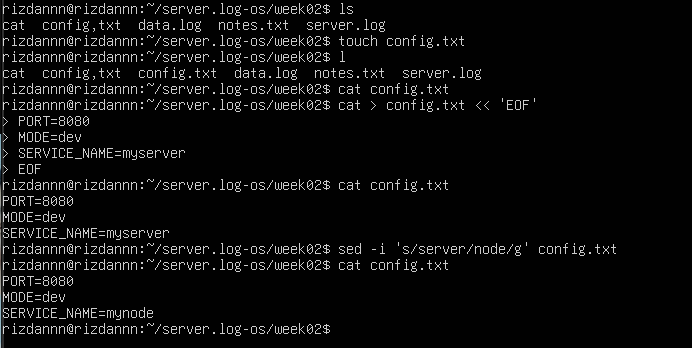

### Latihan 2.E
#### Gunakan df -h lalu awk untuk menampilkan filesystem yang penggunaan disk di atas 70%.
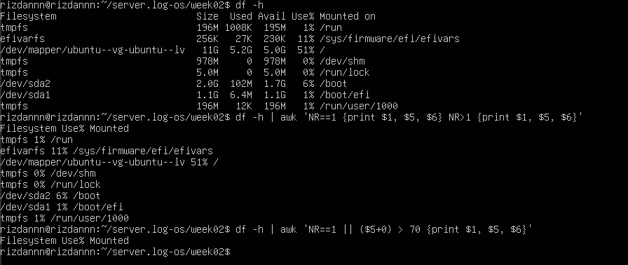

###  Latihan 2.F
#### Jalankan sleep 600 &. Temukan PID-nya dengan ps. Hentikan dengan SIGTERM. Jelaskan beda SIGTERM vs SIGKILL.
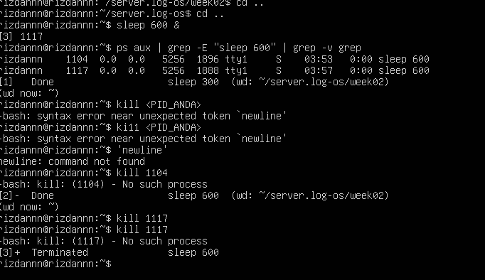

Jawaban : PID-nya 1104 dan 1117, sigterm itu sifatnya halus dan sopan sedangkan sigkill sifatnya mamaksa dan kasar.

### Latihan 2.G
#### Gunakan systemctl –failed. Jika tidak ada yang gagal, pilih satu service aktif (misal ssh) dan tampilkan status serta 30 baris log terakhirnya.

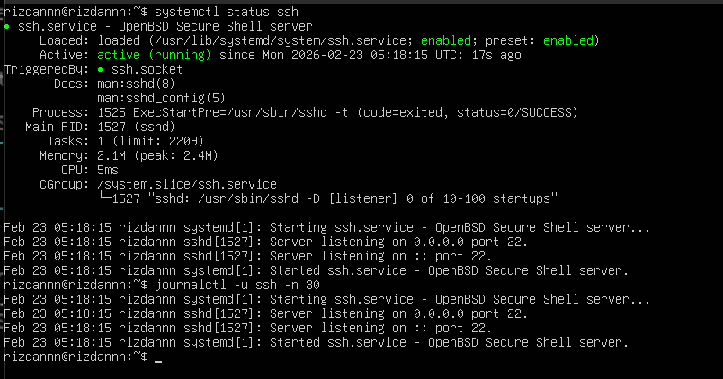

